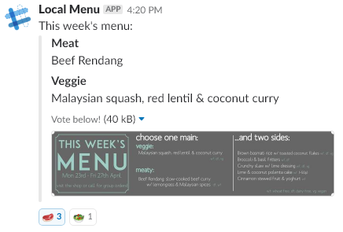

# Slack Local Menu

A simple message sending bot to determine the current menu at [Tiffin Time](https://www.tiffintime.co.uk/). It pulls text and image description, formats message then sends into our slack team.

Utilises the Web API using a bot token, so that the timestamp can be obtained from the posted message, and therefore reactions can be added to the initial message.

Screenshot example of message output:

## Technical details

This application uses .net core SDK and targets .netcore2.1

## Publishing

### Windows

For publishing to windows, I generally publish via Visual studio, targetting windows. Straight foward - just choose approrpiate options.

### Raspbian

To publish to as rasberry pi (Raspbian Stretch at time of writing):

* TargetFramework within TiffinTime.csproj _must be_ >= netcoreapp2.1
* `dotnet publish -r linux-arm`
* Install dependencies: [https://github.com/dotnet/core/blob/master/samples/RaspberryPiInstructions.md](https://github.com/dotnet/core/blob/master/samples/RaspberryPiInstructions.md)
  * Use `./bin/Debug/netcoreapp2.0/<runtime identifier>/publish` (i.e. self contained folder)
  * copy to Raspberry pi
  * `chmod +x TiffinTime`
  * run with `./TiffinTime`